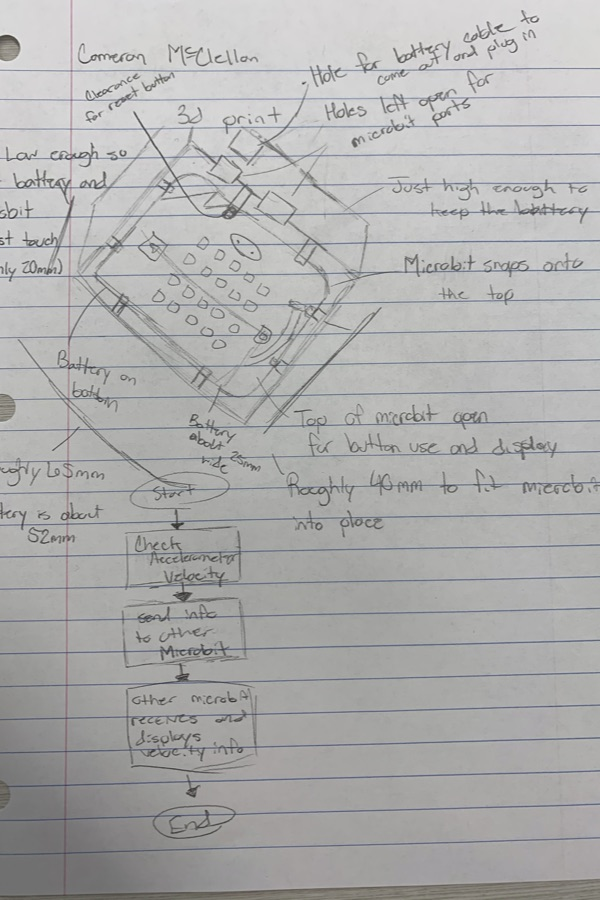

# Mission-to-Mars-Documentation
- Mars Martians
- Our enclosure sets the microbit on top of the battery and feeds the wire through the case.
- 
- Screenshots of our data are located below.
- 
- Overview
- We began designing our enclosure and tweaked it to get the best performance in a short amount of time. We had to expiriment with the microbits to get them to work like they are supposed to and got it working. 
- Our original design looked something like this which has been drastically changed.
- 
